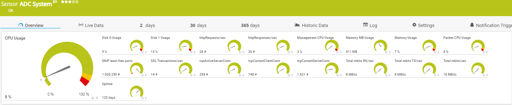

# PRTG-CitrixADC.PS1

<!-- ABOUT THE PROJECT -->
### About The Project
Project Owner: Jannos-443

PRTG Powershell Script to monitor Citrix ADC

Free and open source: [MIT License](https://github.com/Jannos-443/PRTG-CitrixADC/blob/master/LICENSE)

This sensor library relies on the [NetScaler PowerShell module](https://www.powershellgallery.com/packages/NetScaler) written by Brandon Olin.

Sensor is a Updated Fork from https://github.com/xawen/PRTG-NetScaler

### Working on
- more Stats (aaa ...)
- if you are missing something please open an issue

<!-- GETTING STARTED -->
## Getting Started
1. Create a user on the NetScaler with the read-only Command Policy

2. On the PRTG Server open a Powershell (x86) prompt as admin and run:
	- Install-Module -Name NetScaler -scope AllUsers
	- Set-ExecutionPolicy Unrestricted
	- Note:  This MUST be done in the (x86) version of powershell

3. Place `PRTG-CitrixADC.ps1` under `C:\Program Files (x86)\PRTG Network Monitor\Custom Sensors\EXEXML`

4. Copy all `.ovl` files to `C:\Program Files (x86)\PRTG Network Monitor\lookups\custom`

5. In PRTG go to Setup > Administrative tools:
	- Reload lookups

6. Create new sensor

   | Settings | Value |
   | --- | --- |
   | EXE/Script Advanced | PRTG-CitrixADC.ps1 |
   | Parameters | -Hostname "%host" -Username "%linuxuser" -Password "%linuxpassword" -https -System |
   | Scanning Interval | 10 minutes |


7. Change parameter if needed
   - Include/Exclude
   - Change Limits

## Usage

### Using PRTG Sensor variables for Hostname, Username and Password

```powershell
-Hostname '%host' -Username '%linuxuser' -Password '%linuxpassword' -System -https
```

### Using HTTPS API Access (should be used)

```powershell
-Hostname "YourHostname" -Username "YourUsername" -Password "YourPassword" -https -System
```

### Using HTTPS API Access and Ignore Invalid Certs (you should prefer to have a Valid Cert)

```powershell
-Hostname "YourHostname" -Username "YourUsername" -Password "YourPassword" -https -System -IgnoreCert
```

### ADC System

```powershell
...  -System
```



### ADC High Availability

```powershell
...  -HA
```


### ADC CertExpiration

```powershell
...  -CertExpiration
```
```powershell
...  -CertExpiration -IncludeCerts '^(\*\.contoso.com)$'
```


### ADC CertExpiration Details (channel for each cert)

```powershell
...  -CertExpiration -IncludeCerts '^(\*\.contoso.com)$' -CertDetails
```


### ADC ConfigSaved
- If you have IP Reputation enabled, the NetScaler will also update the reputation database ever 5 minutes (default).  When this happens, the "Last Config Changed Time" time will be updated.  This will cause the "Time since changes were saved" counter to be inaccurate.

```powershell
...  -ConfigSaved
```


### ADC Interface

```powershell
...  -Interface
```


### ADC vServer

```powershell
... -vServer
```


### ADC vServer Health (channel for each vServer)

```powershell
... -vServerHealth
```

```powershell
... -vServerHealth -vServerHealthErrLimit 20 vServerHealthWarLimit 50
```


### ADC vServer State (channel for each vServer)

```powershell
... -vServerState
```


## Includes/Excludes

include/exclude vServer Types (CSvServer, LBvServer, VPNvServer and AAAvServer)

```powershell
... -vServerState -IncludevServerType '^(CSvServer|LBvServer)$'
```

include/exclude vServer Names

```powershell
... -vServerState -IncludevServerName '^(Test123.*|LBTest)$'
```

include/exclude Certs

```powershell
... -CertExpiration -IncludeCerts '^(\*\.contoso.com)$'
```

The variables take a regular expression as input to provide maximum flexibility.

For more information about regular expressions in PowerShell, visit [Microsoft Docs](https://docs.microsoft.com/en-us/powershell/module/microsoft.powershell.core/about/about_regular_expressions).

".+" is one or more charakters
".*" is zero or more charakters